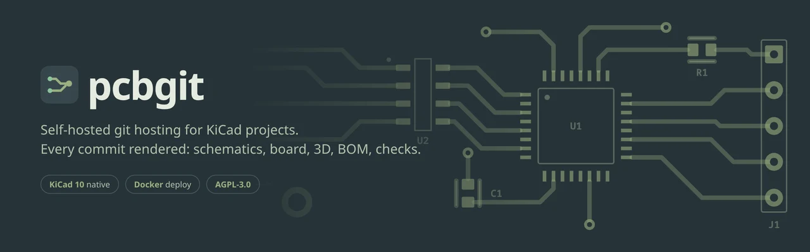
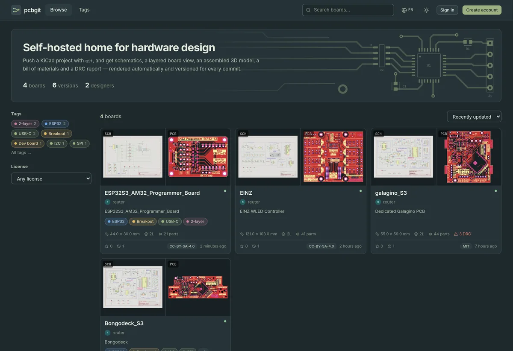
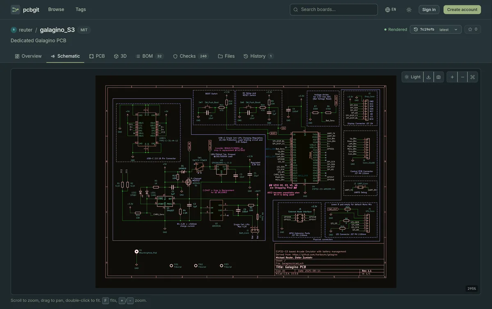
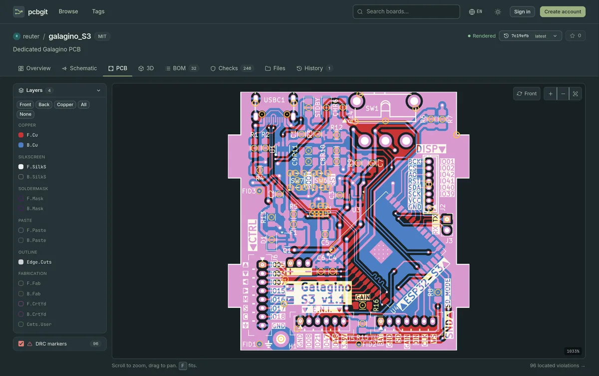
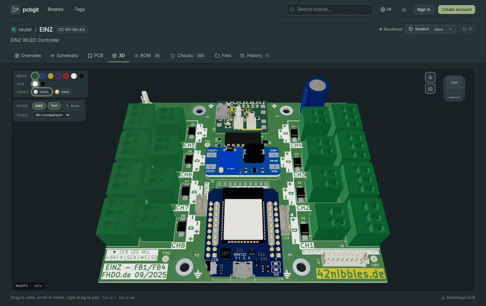
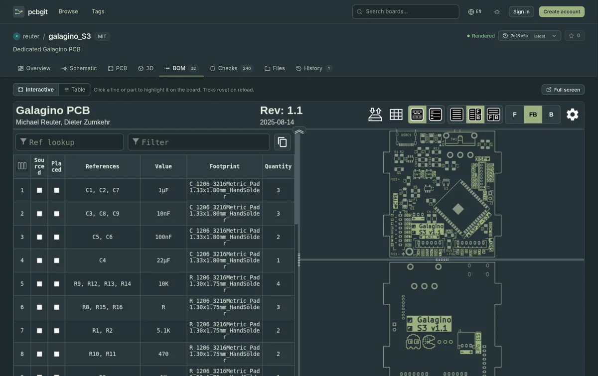
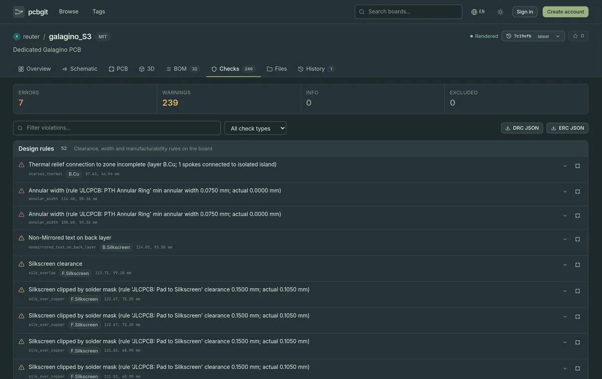
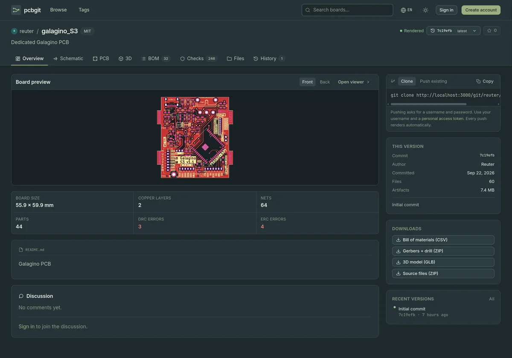
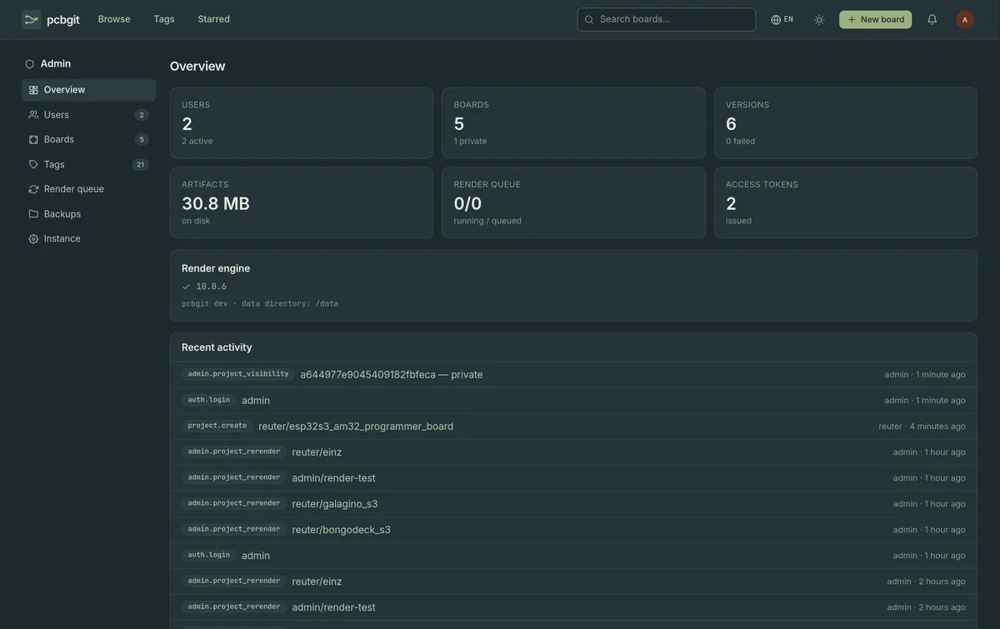

<p align="center">
  
</p>

<p align="center">
  <b>Self-hosted git hosting for KiCad projects.</b><br>
  Push a board and every commit is rendered: schematics, board layers, an assembled 3D
  model, the BOM and DRC/ERC results — all viewable in the browser.
</p>

<p align="center">
  <b><a href="https://pcbgit.com">Live demo at pcbgit.com</a></b> — browse real boards without an account.<br>
  <sub>Sign-ups are disabled there; run your own instance to push boards.</sub>
</p>

<p align="center">
  
  
  
  
</p>

<p align="center">
  <a href="https://pcbgit.com">Demo</a> ·
  <a href="#quick-start">Quick start</a> ·
  <a href="#deploying-to-a-server">Deploy</a> ·
  <a href="#using-pcbgit">Usage</a> ·
  <a href="#configuration">Configuration</a> ·
  <a href="#development">Development</a>
</p>

---

<p align="center">
  
</p>

## Contents

- [Features](#features)
- [Screenshots](#screenshots)
- [Quick start](#quick-start)
- [Deploying to a server](#deploying-to-a-server)
- [Updating](#updating)
- [Using pcbgit](#using-pcbgit)
- [Configuration](#configuration)
- [Troubleshooting](#troubleshooting)
- [Development](#development)
- [License](#license)

## Features

### Viewers

| | What you get |
|---|---|
| **Schematic** | Every sheet, pan and zoom, light or dark, export as PNG/JPEG up to 600 dpi |
| **PCB 2D** | Stacked layers with per-layer toggles, front/back flip, DRC markers with zoom-to-error |
| **PCB 3D** | Assembled board with components, view cube, soldermask/silkscreen colours, HASL/ENIG finish, SMD/THT toggles, ruler, scale objects, image export |
| **BOM** | Interactive view with placement highlighting ([iBOM]), grouped line items, CSV export, diff between any two versions |
| **Checks** | KiCad DRC and ERC, grouped by severity, linked to their spot on the board |
| **History** | Renders and logs per commit, source ZIP downloads |

### Hosting

- Push and clone over **HTTPS with personal access tokens**, or upload a ZIP
- **Public and private boards**, stars, threaded comments with notifications
- **Admin panel**: users, boards, colour-coded tags, render queue, backups, updates
- **Snapshots** for backup and moving to a new server
- **One-click updates** from GitHub with a changelog
- **English and German** interface, six colour themes

### Stack

SvelteKit, SQLite (`node:sqlite`), bare git repositories on disk. Rendering uses
`kicad-cli` from KiCad 10, which the Docker image includes. 3D models are joined
and compressed at render time, so a 29 MB KiCad export becomes a ~6 MB download.

[iBOM]: https://github.com/openscopeproject/InteractiveHtmlBom

## Screenshots

<table>
  <tr>
    <td width="50%"><br><b>Schematic</b> — every sheet, pan and zoom, light or dark.</td>
    <td width="50%"><br><b>PCB 2D</b> — layer stack, board flip, DRC markers.</td>
  </tr>
  <tr>
    <td><br><b>PCB 3D</b> — assembled board, mask and finish colours, ruler.</td>
    <td><br><b>BOM</b> — interactive placement view, CSV export, version diff.</td>
  </tr>
  <tr>
    <td><br><b>Checks</b> — DRC and ERC by severity, with board coordinates.</td>
    <td><br><b>Overview</b> — preview, stats, README, discussion.</td>
  </tr>
</table>

<details>
<summary><b>Admin panel</b></summary>



Users, boards, tags, the render queue, snapshots and in-app updates.

</details>

## Quick start

Requires Docker with the Compose plugin.

```sh
git clone https://github.com/Reutertu3/pcbgit.git
cd pcbgit
cp .env.example .env      # set PCBGIT_ADMIN_PASSWORD
docker compose up -d --build
```

Open <http://localhost:3000> and sign in as `admin`.

> [!TIP]
> The first build takes a few minutes: it downloads KiCad and its 3D model
> library. Later builds reuse those layers. To skip the several-GB model library,
> build with `--build-arg INSTALL_3D_MODELS=false`; the 3D view then shows bare
> boards without components.

All data (database, repositories, renders) lives in the `pcbgit-data` volume.
Create your first board with **New board**, or push one over git — see
[Using pcbgit](#using-pcbgit).

### On a LAN, without a domain

pcbgit needs no domain, no HTTPS and no extra configuration for this: it answers
on every address it is reached at. Start it as above and share the machine's
address, for example `http://192.168.1.50:3000` or `http://pcbgit.lan:3000`.
Colleagues sign in, push and clone from phones and laptops; the clone box always
shows the address that visitor is using.

> [!NOTE]
> A form post must come from the address it was loaded from, which is what stops
> other sites posting here. Put pcbgit behind a reverse proxy only if it passes
> the client's `Host` header through — Caddy's `reverse_proxy` does, and the
> provided production setup sets `PCBGIT_DOMAIN` anyway.

## Deploying to a server

Tested on Debian 13. Caddy runs in front of pcbgit and handles HTTPS with a
Let's Encrypt certificate. pcbgit itself is not exposed.

**Requirements:** 2 GB RAM, 8 GB free disk, a domain name. Run the commands below
as root.

> [!IMPORTANT]
> Set `PCBGIT_DOMAIN` to the bare domain and give `PCBGIT_ADMIN_PASSWORD` a long
> random value before the first start. A wrong domain makes every form post fail
> with a cross-site error, because it decides the app's `ORIGIN`.

### 1. Install Docker

Use Docker's repository. Debian's `docker.io` package is too old.

```sh
apt update && apt install -y ca-certificates curl git ufw
install -m 0755 -d /etc/apt/keyrings
curl -fsSL https://download.docker.com/linux/debian/gpg -o /etc/apt/keyrings/docker.asc
echo "deb [signed-by=/etc/apt/keyrings/docker.asc] https://download.docker.com/linux/debian $(. /etc/os-release && echo $VERSION_CODENAME) stable" \
  > /etc/apt/sources.list.d/docker.list
apt update && apt install -y docker-ce docker-ce-cli containerd.io docker-buildx-plugin docker-compose-plugin
```

### 2. DNS and firewall

Point the domain's A record (and AAAA, if you use IPv6) at the server. It must
resolve before the first start, or Caddy cannot get a certificate.

```sh
ufw allow OpenSSH && ufw allow 80,443/tcp && ufw allow 443/udp && ufw enable
```

### 3. Get the code and configure it

```sh
git clone https://github.com/Reutertu3/pcbgit.git /opt/pcbgit
cd /opt/pcbgit
cp .env.example .env
nano .env
```

Set in `.env`:

| Variable | Value |
|---|---|
| `PCBGIT_DOMAIN` | The bare domain, e.g. `pcb.example.com`. No `https://`, no slash. |
| `PCBGIT_ADMIN_PASSWORD` | A long random password, e.g. from `openssl rand -base64 24` |

For a private repository, add a read-only
[deploy key](https://docs.github.com/en/authentication/connecting-to-github-with-ssh/managing-deploy-keys)
and clone with the `git@github.com:` URL.

### 4. Install and start

```sh
deploy/install.sh    # systemd units for updates; checks .env
deploy/update.sh     # first build and start
```

Open `https://<your domain>` and sign in as `admin`. Consider switching off open
registration under **Admin → Instance**.

`install.sh` adds `COMPOSE_FILE` to `.env`, so plain `docker compose` commands
on the server always use the production setup.

<details>
<summary><b>Moving an existing instance to this server</b></summary>

1. On the old instance, create a snapshot under **Admin → Backups** and download it.
2. On the new server, run `install.sh` (step 4), but not `update.sh` yet.
3. Copy the snapshot to `/var/lib/pcbgit-control/import.tar.gz`.
4. Add `PCBGIT_IMPORT_SNAPSHOT=/control/import.tar.gz` to `.env`.
5. Run `update.sh`. The snapshot is imported on first start.
6. Sign in with the admin account from the old instance, then delete the file and the `.env` line.

</details>

## Updating

pcbgit checks GitHub for new commits every hour. When updates are available,
**Admin → Overview** shows a banner and **Admin → Instance** lists the new
commits as a changelog.

To update, either:

- press **Update from GitHub** under **Admin → Instance**, or
- run `/opt/pcbgit/deploy/update.sh` on the server.

Both pull from GitHub, rebuild and restart. The site is down for a few seconds.
**Check now** runs the GitHub check immediately.

<details>
<summary>How updating works, and what can go wrong</summary>


- Only fast-forward pulls are done. If the server copy has its own commits, the
  update stops and the panel says so.
- The container cannot run commands on the host. The button writes a request file
  to `/var/lib/pcbgit-control`; a systemd unit on the host picks it up.
- Each update re-syncs the systemd units. After updating an existing server to this
  version for the first time, run `deploy/install.sh --units-only` once.
- `systemctl status pcbgit-update.service` shows the last run on the server.

</details>

## Using pcbgit

### Push a board

1. Create a board with **New board**.
2. Create a token under **Settings → Access tokens**.
3. Push your KiCad project:

   ```sh
   git remote add pcbgit https://<your domain>/git/<user>/<board>.git
   git push pcbgit main
   ```

   Use your username and the token as the password.

pcbgit renders the shallowest `.kicad_pro` in the repository together with its
`.kicad_sch` and `.kicad_pcb`. Public boards can be cloned without a token.

> [!NOTE]
> Every push renders in the background. Watch it under **History**, which keeps
> the log of each version, or in **Admin → Render queue**.

### Backups

Under **Admin → Backups** you can create, download, upload and restore snapshots.
A snapshot is one `.tar.gz` with the database, all repositories and, optionally,
the rendered output.

- **Restore** moves the current data to `backups/pre-restore-<time>/` instead of
  deleting it, then restarts pcbgit.
- **Large snapshots** that exceed the upload limit can be copied in directly:
  `docker compose cp snapshot.tar.gz pcbgit:/data/backups/`

> [!WARNING]
> A restore replaces users, boards, repositories and settings with the snapshot's.
> The previous data is moved to `backups/pre-restore-<time>/` rather than deleted,
> so it can be recovered by hand.

## Configuration

Set these in `.env`:

| Variable | Default | Purpose |
|---|---|---|
| `PCBGIT_DOMAIN` | — | Public domain (production). Used by Caddy and to set `ORIGIN`. |
| `PCBGIT_ORIGIN` | `http://localhost:3000` | Public URL, used for links in server-rendered pages and for the cookie's scheme. Optional on a LAN: any address works. |
| `PCBGIT_ADMIN_USER` | `admin` | Admin account created when no active admin exists |
| `PCBGIT_ADMIN_PASSWORD` | — | Password for that account. Required. |
| `PCBGIT_ADMIN_EMAIL` | `admin@localhost` | Email for that account |
| `PCBGIT_IMPORT_SNAPSHOT` | — | Snapshot to import on the first start of an empty instance |
| `COMPOSE_FILE` | — | Set by `install.sh` so `docker compose` uses the production setup |
| `PCBGIT_SOURCE_URL` | `https://github.com/Reutertu3/pcbgit` | Repository linked as "Source" in the footer. Forks must set their own. |

<details>
<summary>Set in the image or compose files; rarely changed</summary>

| Variable | Default | Purpose |
|---|---|---|
| `PCBGIT_DATA_DIR` | `/data` | Database, repositories and renders |
| `PCBGIT_CONTROL_DIR` | `/control` (production) | Folder shared with the host for updates. Unset disables in-app updates. |
| `PCBGIT_KICAD_CLI` | `kicad-cli` | Path to the KiCad CLI |
| `PCBGIT_IBOM` | set in the image | iBOM's `generate_interactive_bom.py`. Unset skips the interactive BOM. |
| `BODY_SIZE_LIMIT` | `210M` | Maximum upload and push size |
| `PCBGIT_RESTART_ON_RESTORE` | `true` | Restart after staging a restore |

</details>

## Troubleshooting

| Symptom | Cause and fix |
|---|---|
| Pages load, but forms are rejected as submitted from a different address | Something between browser and pcbgit rewrites the `Host` header, or the page was opened at one address and posts to another. Check the reverse proxy passes `Host` through. |
| 502 from Caddy | pcbgit is starting or has stopped. Check `docker compose logs pcbgit`. |
| No certificate / HTTPS fails | DNS does not point at the server yet, or ports 80/443 are blocked. Check `docker compose logs caddy`. |
| A version shows "Render failed" | Open the board's **History** tab and view the render log. |
| Update fails | The log is shown under **Admin → Instance**. A diverged server copy is the usual cause: `git reset --hard origin/<branch>` in `/opt/pcbgit`. |

## Development

Requires Node 24+ and git. Rendering needs `kicad-cli`; without it, pcbgit still
tracks versions and builds the BOM, but produces no schematic, board, 3D or DRC
output.

```sh
npm install
npm run dev      # http://localhost:5173
npm test         # unit and end-to-end tests
npm run check    # type check
npm run seed     # demo boards
```

After editing `src/lib/server/db/schema.sql`, run `npm run schema`. Columns added
to existing tables also need an entry in `ADDED_COLUMNS` in
`src/lib/server/db/index.ts`.

### Translations

The interface is available in English and German; the globe button in the header
switches, and the choice is saved in a cookie. First-time visitors get their
browser's language.

Strings live in `src/lib/i18n/en.json` and `de.json`. To add a language, copy
`en.json`, translate it, and register it in `LOCALES` in `src/lib/i18n/index.ts`.
`npm test` fails if a file is missing keys or placeholders. KiCad's own DRC/ERC
messages and render logs stay in English.

<details>
<summary><b>Project layout</b></summary>

```
src/lib/server/
  db/              SQLite schema and queries
  auth.ts          passwords, sessions, access tokens
  git.ts           bare repositories, commits from uploads
  githttp.ts       git smart-HTTP (clone and push)
  projects.ts      boards, tags, stars, commit indexing
  render/          render queue, kicad-cli wrapper, parsers, GLB optimisation
  backups.ts       snapshots
  restore.ts       snapshot validation and restore
  updater.ts       update requests and status
src/lib/i18n/      translations (en.json, de.json) and lookup
src/routes/
  [owner]/[project]/   board pages: overview, schematic, pcb, 3d, bom, drc, files, history
  git/                 git endpoint
  admin/               admin panel
deploy/
  docker-compose.prod.yml, Caddyfile   production setup
  install.sh, update.sh                server setup and updates
```

The render worker runs inside the app and processes one job at a time. Jobs
interrupted by a restart are marked failed at boot and can be retried from
**Admin → Render queue**.

</details>

## License

pcbgit is © 2026 Michael Reuter and licensed under the
[GNU Affero General Public License v3.0 or later](LICENSE).

You can use, modify and host pcbgit, including commercially. If you run a
modified version for others over a network, you must offer them its source code.
The footer's credit to the original project must be kept. See [NOTICE.md](NOTICE.md)
for the exact terms and for the licenses of third-party software pcbgit uses.
