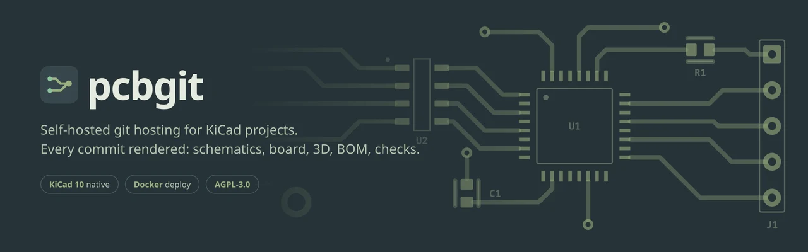
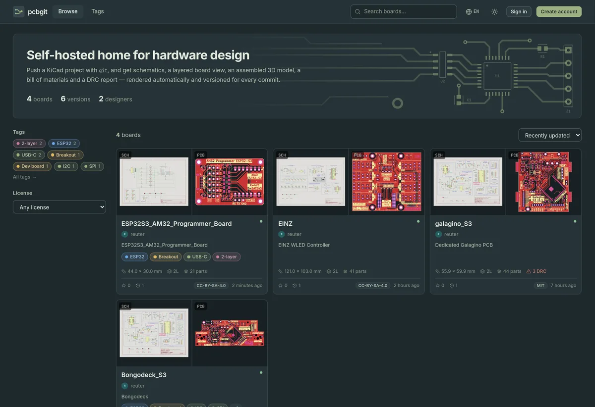
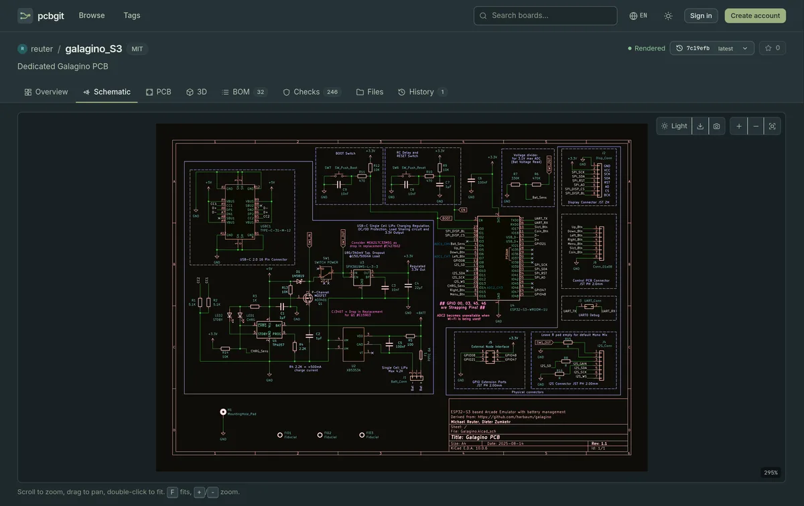
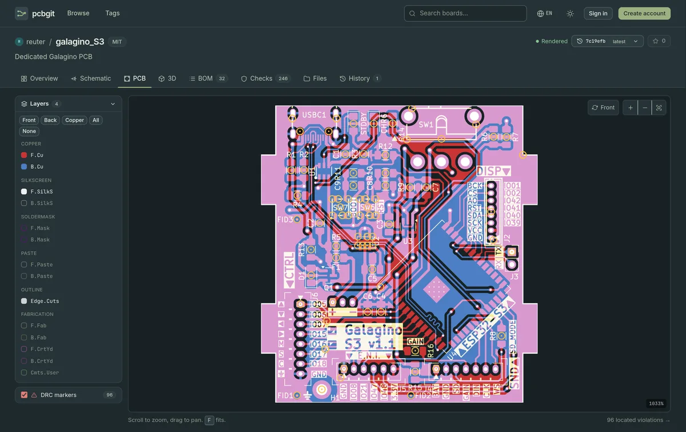
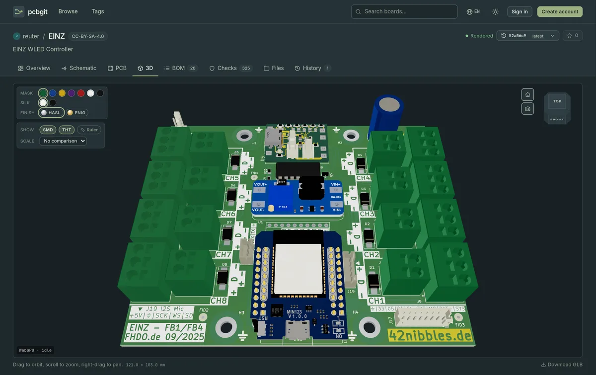
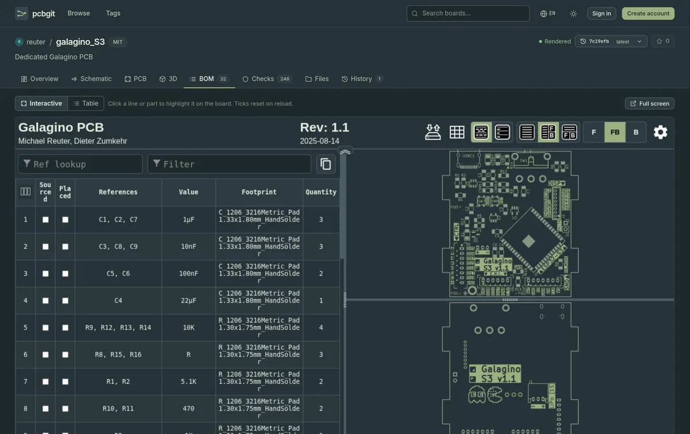
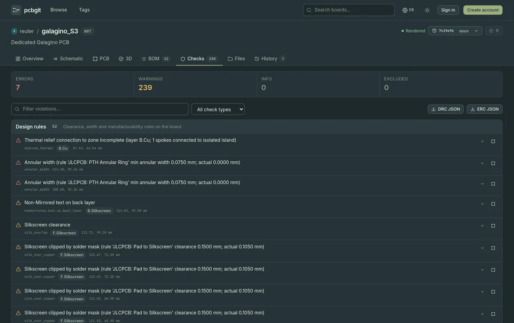
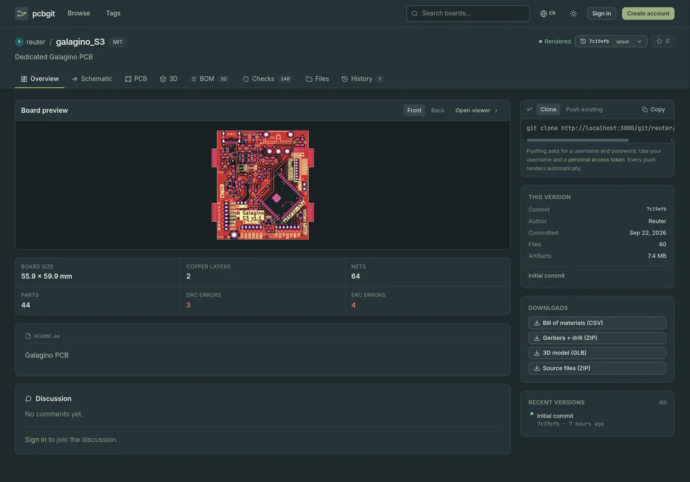
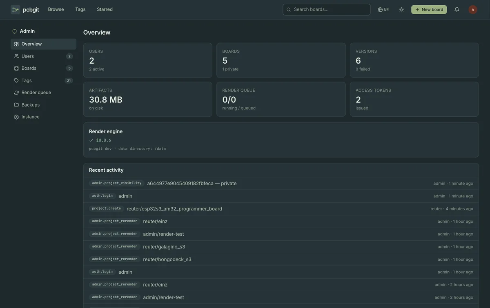
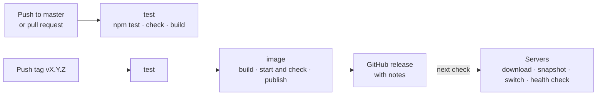

<p align="center">
  
</p>

<p align="center">
  <b>Self-hosted git hosting for KiCad projects.</b><br>
  Push a board and every commit is rendered: schematics, board layers, an assembled 3D
  model, the BOM, DRC/ERC results and fabrication files — all in the browser.
</p>

<p align="center">
  <b><a href="https://pcbgit.com">Live demo at pcbgit.com</a></b><br>
  <sub>Sign-ups are disabled there; run your own instance to push boards.</sub>
</p>

<p align="center">
  
  
  
  
</p>

<p align="center">
  <a href="#features">Features</a> ·
  <a href="#quick-start">Quick start</a> ·
  <a href="#deploying-to-a-server">Deploy</a> ·
  <a href="#updating">Updating</a> ·
  <a href="#using-pcbgit">Usage</a> ·
  <a href="#configuration">Configuration</a> ·
  <a href="#troubleshooting">Troubleshooting</a> ·
  <a href="#development">Development</a> ·
  <a href="#releases-and-ci">Releases</a> ·
  <a href="#forking">Forking</a>
</p>

---

<p align="center">
  
</p>

## Features

### Viewers

| | What you get |
|---|---|
| **Schematic** | Every sheet, pan and zoom, light or dark, PNG/JPEG export up to 600 dpi, all sheets as one PDF |
| **PCB 2D** | Stacked layers with per-layer toggles, front/back flip, DRC markers with zoom-to-error |
| **PCB 3D** | Assembled board with components, view cube, soldermask/silkscreen colours, HASL/ENIG finish, SMD/THT toggles, ruler, scale objects, image export, STEP download |
| **BOM** | Interactive view with placement highlighting ([iBOM]), grouped line items with MPN and LCSC part numbers (linked to LCSC), CSV export, diff between any two versions |
| **Checks** | KiCad DRC and ERC, grouped by severity, linked to their spot on the board |
| **Fabrication** *(experimental)* | Gerbers and drill files for **JLCPCB**, **AISLER** or generic KiCad names |
| **Eagle import** | Eagle 6+ projects are converted on upload or push and marked *Converted*; the converted KiCad project is a download |
| **History** | Renders and logs per commit, source ZIP downloads |

### Hosting

- Push and clone over **HTTPS with personal access tokens**, or upload a ZIP
- **Public and private boards**, stars, threaded comments with notifications
- **Two-factor sign-in** (optional: authenticator app, recovery codes)
- **Curated tags** in categories; users request missing ones, admins approve them
- **Admin panel**: users, boards, tags, render queue, backups, updates, per-user
  limits (boards, storage, queued renders, uploads and pushes per hour, push
  size, comments per hour),
  approval of new accounts
- **Snapshots** for backups and moving servers
- **One-click and automatic updates** with a changelog
- **English and German**, eight colour themes

### Stack

SvelteKit, SQLite (`node:sqlite`), bare git repositories. Rendering uses
`kicad-cli` from KiCad 10, included in the Docker image, in a sandboxed container
without database or network access. 3D models are joined and compressed at render
time: a 29 MB KiCad export becomes a ~6 MB download.

[iBOM]: https://github.com/openscopeproject/InteractiveHtmlBom

## Screenshots

<table>
  <tr>
    <td width="50%"><br><b>Schematic</b></td>
    <td width="50%"><br><b>PCB 2D</b></td>
  </tr>
  <tr>
    <td><br><b>PCB 3D</b></td>
    <td><br><b>BOM</b></td>
  </tr>
  <tr>
    <td><br><b>Checks</b></td>
    <td><br><b>Overview</b> — preview, stats, README, downloads, discussion</td>
  </tr>
</table>

<details>
<summary><b>Admin panel</b></summary>



</details>

## Quick start

Requires Docker with the Compose plugin.

```sh
git clone https://github.com/Reutertu3/pcbgit.git
cd pcbgit
cp .env.example .env      # set PCBGIT_ADMIN_PASSWORD
docker compose up -d --build
```

Open <http://localhost:3000> and sign in as `admin` (another port: `PCBGIT_PORT`
in `.env`). All data lives in the `pcbgit-data` volume. Create a board with
**New board**, or push one over git (see [Using pcbgit](#using-pcbgit)).

> [!TIP]
> The first build downloads KiCad and its 3D model library and takes a few
> minutes; later builds reuse them. `--build-arg INSTALL_3D_MODELS=false` skips
> the several-GB model library, and the 3D view then shows bare boards.

### On a LAN, without a domain

No extra configuration: pcbgit answers on every address it is reached at, e.g.
`http://192.168.1.50:3000` or `http://pcbgit.lan:3000`, and the clone box shows
the address each visitor uses. A reverse proxy in front must pass the client's
`Host` header through (Caddy's `reverse_proxy` does).

## Deploying to a server

Tested on Debian 13, with Caddy in front for HTTPS (Let's Encrypt); pcbgit itself
is not exposed. **Requirements:** 2 GB RAM, 8 GB free disk (about 15 GB to build
on the server instead of downloading the image), a domain. Run the commands as
root.

> [!IMPORTANT]
> The domain must be the bare domain the site is reached at. A wrong one makes
> every form post fail with a cross-site error, since it sets the app's `ORIGIN`.
> `install.sh` checks it; so does `update.sh` for a `.env` written by hand.

### 1. Install Docker

From Docker's repository; Debian's `docker.io` is too old.

```sh
apt update && apt install -y ca-certificates curl git ufw
install -m 0755 -d /etc/apt/keyrings
curl -fsSL https://download.docker.com/linux/debian/gpg -o /etc/apt/keyrings/docker.asc
echo "deb [signed-by=/etc/apt/keyrings/docker.asc] https://download.docker.com/linux/debian $(. /etc/os-release && echo $VERSION_CODENAME) stable" \
  > /etc/apt/sources.list.d/docker.list
apt update && apt install -y docker-ce docker-ce-cli containerd.io docker-buildx-plugin docker-compose-plugin
```

### 2. DNS and firewall

Point the domain's A record (and AAAA for IPv6) at the server before the first
start, or Caddy cannot get a certificate.

```sh
ufw allow OpenSSH && ufw allow 80,443/tcp && ufw allow 443/udp && ufw enable
```

### 3. Get the code, configure and start

```sh
git clone https://github.com/Reutertu3/pcbgit.git /opt/pcbgit
/opt/pcbgit/deploy/install.sh
```

`install.sh` asks for the settings and writes `.env` (an existing one is kept;
only what is missing is asked for):

| Asked for | Notes |
|---|---|
| Domain | Bare, e.g. `pcb.example.com`; it warns if the DNS record does not point at this server yet |
| Administrator | Username, email, and a password it can generate. The password is only used when no administrator exists: on the first start, not after restoring a snapshot |
| Renderer limits | Memory and CPU for kicad-cli and the 3D export, suggested from the server's size |
| Snapshot copy folder | Optional: a folder on another disk or a NAS mount for scheduled snapshots; handed to uid 10001 |

It sets up the systemd units for updates, then offers what to start, showing the
free disk space:

1. **The newest release as the image GitHub built** (the default): about a 1 GB
   download, a minute or two. Only offered where it can run: GitHub builds for
   x86-64 servers, so ARM ones (a Raspberry Pi) build instead.
2. **The newest release, built on this server:** several minutes, and about 15 GB
   of disk while building (KiCad and its 3D models).
3. **The newest `master`, built on this server,** for unreleased changes.

It prints each step; the details are in `/var/lib/pcbgit-control/update.log`
(`tail -f` it in a second session).

For a private repository, add a read-only
[deploy key](https://docs.github.com/en/authentication/connecting-to-github-with-ssh/managing-deploy-keys)
and clone the `git@github.com:` URL.

<details>
<summary>Without the questions (scripts, automation)</summary>

Write `.env` yourself from `.env.example` (at least `PCBGIT_DOMAIN` and
`PCBGIT_ADMIN_PASSWORD`), then run `deploy/install.sh` without a terminal, or
with its input redirected, and start with `deploy/update.sh --release` (the
release image, or a build where there is none) or `deploy/update.sh` (master,
built here).

</details>

Open `https://<your domain>` and sign in as `admin`. Under **Admin → Instance**,
choose closed or open registration (open: each new account needs an admin's
approval, the default) and per-user limits. **Admin → Users** approves accounts
and sets limits per user; admins are notified of each new account. The `.env`
admin is the owner: other admins cannot demote, disable or delete it, or reset
its password.

`install.sh` adds `COMPOSE_FILE` to `.env`, so plain `docker compose` on the
server uses the production setup.

<details>
<summary><b>Moving an existing pcbgit to a new server</b></summary>

1. On the old server, create a snapshot under **Admin → Backups** and download it.
2. Set up the new server as above and sign in with its `.env` admin.
3. Under **Admin → Backups**, upload and restore the snapshot. pcbgit restarts
   with the old server's users, boards, settings and accounts.

Snapshots of any size can be uploaded, or copied in on the server; see
[Backups](#backups).

</details>

## Updating

pcbgit checks GitHub automatically, every hour by default (set next to **Check
now** under **Admin → Instance**: hourly, daily, weekly or monthly). The panel
shows the newest release, whether its image is ready, and the commits on
`master` since the running version.

| | **Releases** | **Update from GitHub** |
|---|---|---|
| What | The newest tag `vX.Y.Z` (pre-releases like `v0.8.0-rc1` are skipped) | The newest commit on `master`, for trying unreleased changes |
| How | Downloads the image CI built and checked: about a minute | Builds on the server: several minutes |
| Start | **Install v…** or **Automatic updates** (at the next check) under **Admin → Instance**, or `deploy/update.sh --release` | **Update from GitHub** under **Admin → Instance**, or `/opt/pcbgit/deploy/update.sh` |

Neither goes backwards: after a build of `master`, automatic updates wait for the
next release after it. A release whose image is still building is waited for.
The site is down for a few seconds during the restart; the panel shows each step
with a progress bar.

Every update is guarded on both sides:

- **Before:** the running version takes a snapshot without rendered output
  (`…-pre-update.tar.gz`, newest three kept under **Admin → Backups**). Database
  changes run once at the new version's first start and cannot be undone; this
  snapshot is the way back.
- **After:** the new version must pass its health check within five minutes, or
  the previous image and checkout come back, the panel says so, and automatic
  updates skip that release. The data stays as it is; restore the snapshot if it
  must go back too.

The first release download is about 1 GB (KiCad and its 3D models); later
releases share that layer and bring around 10 MB.

<details>
<summary>How updating works, and what can go wrong</summary>

- Only fast-forward pulls. If the server copy has its own commits, the update
  stops and the panel says so.
- The container cannot run commands on the host: the panel writes request files
  to `/var/lib/pcbgit-control`, where systemd units on the host pick them up. The
  automatic-update switch (`auto-update`) and the check interval
  (`check-interval`) are files there too; the host's timer wakes the check hourly
  and skips it until the chosen interval has passed.
- Automatic updates start only when the release's image is ready (or the server
  builds itself). A failed one is not retried; the next release is.
- A failed download or build leaves the old version running and moves the
  checkout back, so the next check offers the update again.
- The previous version stays as the image `pcbgit:previous`. To go back by hand:
  `git -C /opt/pcbgit reset --keep <its commit>`, then
  `docker tag pcbgit:previous pcbgit:latest && docker compose up -d`.
- `PCBGIT_UPDATE_SNAPSHOT=false` in `.env` skips the pre-update snapshot.
- Release images come from `ghcr.io/<owner>/<repo>` of the server's GitHub remote
  and must be public; otherwise the server builds the release itself, and the log
  says why.
- Container logs are capped at 5 × 10 MB per service. Each update re-syncs the
  systemd units and restarts Caddy if its config changed.
- `systemctl status pcbgit-update.service` shows the last run.
- After an update that changes rendering, **Admin → Boards → Re-render all**
  updates existing versions.

</details>

## Using pcbgit

### Push a board

1. Create a board with **New board**.
2. Create a token under **Settings → Access tokens**.
3. Push your KiCad project, with your username and the token as password:

   ```sh
   git remote add pcbgit https://<your domain>/git/<user>/<board>.git
   git push pcbgit main
   ```

pcbgit renders the shallowest `.kicad_pro` in the repository with its
`.kicad_sch` and `.kicad_pcb`. Public boards can be cloned without a token. Each
push renders in the background; **History** keeps each version's log, **Admin →
Render queue** shows what is running.

### Downloads

Part numbers in the BOM come from the symbols' fields: `MPN`, `Manufacturer Part
Number`, `Part Number` or `PN` for the manufacturer's, and `LCSC Part`, `LCSC`,
`LCSC Part #`, `JLCPCB` or `JLC` for LCSC's order number (the full lists are in
`render/kicad.ts`; case does not matter). Versions rendered before LCSC numbers
were read (up to v0.7.4) show them after a re-render (History, or **Admin →
Boards → Re-render all**).

A board's overview offers the BOM (CSV), the schematic as one PDF, the 3D model
as STEP (board and component models as solids, with pads, tracks, vias, zones
and silkscreen, for mechanical CAD; versions rendered up to v0.7.4 get one with
a re-render), the
source as ZIP and, under **Production Gerbers**, a fabrication ZIP for
the board house chosen in the dropdown: that fab's file names and drill units,
manufacturing layers only, zones refilled. The Gerber export is experimental:
check the fab's preview before ordering.

### Backups

**Admin → Backups** creates, downloads, uploads and restores snapshots: one
`.tar.gz` with the database, all repositories and optionally the rendered
output. Uploads of any size work (sent in pieces of up to 32 MB); only free disk
space limits them, and 1 GB always stays free. Snapshots can also be copied in:
`docker compose cp snapshot.tar.gz pcbgit:/data/backups/`

**Scheduled snapshots** (same page, off by default) are taken daily or weekly
at a set hour of server time (the container's is UTC), without rendered output
unless chosen. The newest few are kept (7 by default); manual, uploaded and
pre-update snapshots are never deleted by the schedule. A snapshot that would
not fit above the free-disk minimum is skipped and tried again an hour later,
and the page shows the last result. They sit on the same disk as everything
else, so for a real backup set `PCBGIT_BACKUP_COPY_HOST` in `.env` to a folder on
another disk or a NAS mount: each scheduled snapshot is copied there, with the
same retention.

> [!WARNING]
> A restore replaces users, boards, repositories and settings with the
> snapshot's, then restarts pcbgit. The previous data is moved to
> `backups/pre-restore-<time>/`, not deleted.

### Two-factor sign-in

Turn it on under **Settings → Two-factor sign-in**: scan the QR code with an
authenticator app, confirm with a code, keep the ten recovery codes. Sign-in then
asks for a code after the password; git keeps using access tokens. For a new
phone there is **Replace authenticator**. An admin can turn it off for someone
who lost phone and codes (**Admin → Users**); for another admin only the owner
can.

The owner can require it of admins (**Admin → Instance → Administrators need
two-factor sign-in**, off by default; only the owner sees the switch). Then an
account can only be made admin with it turned on, new accounts start as users,
and an admin cannot turn it off: one who lost phone and codes is made a user
first, by the owner, and promoted again once it is set up anew. Admins who had
none before keep their role.

Nobody turns it off for the owner; a locked-out owner runs, on the server:

```sh
docker compose exec pcbgit node --import ./tests/resolve-hook.mjs scripts/reset-owner.ts </dev/null
```

This prints a new random password, turns two-factor sign-in off and ends the
owner's sessions.

## Configuration

Set in `.env`:

| Variable | Default | Purpose |
|---|---|---|
| `PCBGIT_DOMAIN` | — | Public domain (production); used by Caddy and for `ORIGIN` |
| `PCBGIT_PORT` | `3000` | Published port (local and LAN; production uses 80/443) |
| `PCBGIT_ORIGIN` | `http://localhost:<PCBGIT_PORT>` | Public URL for links in server-rendered pages and the cookie's scheme. Optional on a LAN. |
| `PCBGIT_ADMIN_USER` | `admin` | Admin account created when no active admin exists |
| `PCBGIT_ADMIN_PASSWORD` | — | Its password. Required. |
| `PCBGIT_ADMIN_EMAIL` | `admin@localhost` | Its email |
| `PCBGIT_IMPORT_SNAPSHOT` | — | Snapshot imported on the first start of an empty instance |
| `COMPOSE_FILE` | — | Set by `install.sh` so `docker compose` uses the production setup |
| `PCBGIT_SOURCE_URL` | the server's git remote | "Source" link in the footer (AGPL-3.0). `update.sh` takes it from the remote; set it only for a server started without `update.sh`, which otherwise links to this repository. |
| `PCBGIT_RENDER_MEMORY` | `4g` | Renderer memory limit; below the server's total. `0`: none |
| `PCBGIT_RENDER_CPUS` | `2` | Renderer CPU limit. `0`: none |
| `PCBGIT_MIN_FREE_DISK` | `1G` | Always kept free: below it uploads, pushes and snapshots are refused and renders wait |
| `PCBGIT_BACKUP_COPY_HOST` | — | Host folder (e.g. a NAS mount, writable by uid 10001) that scheduled snapshots are also copied to |
| `PCBGIT_UPDATE_IMAGE` | `ghcr.io/<owner>/<repo>` of a GitHub remote | Where releases are pulled from (tagged `sha-<commit>`); `build` builds them on the server |
| `PCBGIT_UPDATE_SNAPSHOT` | `true` | `false` skips the snapshot before updates |

<details>
<summary>Set in the image or compose files; rarely changed</summary>

| Variable | Default | Purpose |
|---|---|---|
| `PCBGIT_DATA_DIR` | `/data` | Database, repositories and renders |
| `PCBGIT_CONTROL_DIR` | `/control` (production) | Folder shared with the host for updates; unset disables in-app updates |
| `PCBGIT_KICAD_CLI` | `kicad-cli` | Path to the KiCad CLI |
| `PCBGIT_IBOM` | set in the image | iBOM's `generate_interactive_bom.py`; unset skips the interactive BOM |
| `BODY_SIZE_LIMIT` | `210M` | Largest request: uploads and pushes (snapshots are sent in smaller pieces). The push size limit under **Admin → Instance** (200 MB) only works below it: raise both for larger pushes |
| `PCBGIT_RESTART_ON_RESTORE` | `true` | Restart after staging a restore |
| `PCBGIT_RENDER_DIR` | `/work` | Render checkouts and output, shared with the `renderer` container |
| `PCBGIT_RENDER_SOCKET` | `/work/runner.sock` | Where the app reaches the renderer; unset runs the tools in the app |
| `ADDRESS_HEADER`, `XFF_DEPTH` | set in production | Client address behind the proxy, for the sign-in limit. Required behind any reverse proxy. |

</details>

## Troubleshooting

| Symptom | Cause and fix |
|---|---|
| Pages load, forms are rejected as from a different address | A proxy rewrites the `Host` header, or the page was opened at one address and posts to another. Pass `Host` through. |
| 502 from Caddy | pcbgit is starting or stopped: `docker compose logs pcbgit` |
| No certificate / HTTPS fails | DNS does not point at the server yet, or ports 80/443 are blocked: `docker compose logs caddy` |
| A version shows "Render failed" | The render log is under the board's **History** tab |
| Render log says "renderer unavailable" | The `renderer` container is not running: `docker compose ps`, `docker compose logs renderer` |
| Update fails | The log is under **Admin → Instance**. Usually a diverged server copy: `git reset --hard origin/<branch>` in `/opt/pcbgit` |

## Development

Requires Node 24+ and git. Without `kicad-cli`, pcbgit still tracks versions and
builds the BOM, but renders no schematic, board, 3D or DRC output.

```sh
npm install
npm run dev      # http://localhost:5173
npm test         # unit and end-to-end tests
npm run check    # type check
npm run seed     # demo boards
npm run reset-owner   # new password for the owner, 2FA off
```

After editing `src/lib/server/db/schema.sql`, run `npm run schema`; columns added
to existing tables also need an entry in `ADDED_COLUMNS` in
`src/lib/server/db/index.ts`. The production image locally:
`docker compose up -d --build`, then <http://localhost:3000>.

### Translations

English and German; the globe button switches (saved in a cookie), first visits
get the browser's language. Strings live in `src/lib/i18n/en.json` and `de.json`.
To add a language, copy `en.json`, translate it and register it in `LOCALES` in
`src/lib/i18n/index.ts`; `npm test` fails on missing keys or placeholders.
KiCad's own DRC/ERC messages and render logs stay in English.

<details>
<summary><b>Project layout</b></summary>

```
src/lib/server/
  db/              SQLite schema and queries
  auth.ts          passwords, sessions, access tokens
  twofactor.ts     two-factor sign-in (TOTP maths in totp.ts)
  git.ts           bare repositories, commits from uploads
  githttp.ts       git smart-HTTP (clone and push)
  projects.ts      boards, tags, stars, commit indexing
  tagrequests.ts   tags users ask for, approved or declined by admins
  render/          render queue, kicad-cli wrapper, parsers, GLB optimisation
  backups.ts       snapshots
  restore.ts       snapshot validation and restore
  updater.ts       update requests and status
src/lib/fab.ts     board-house profiles for the fabrication ZIPs
src/lib/i18n/      translations (en.json, de.json) and lookup
src/routes/
  [owner]/[project]/   board pages: overview, schematic, pcb, 3d, bom, drc, files, history
  git/                 git endpoint
  admin-panel/         admin panel
  login/, settings/    sign-in (with the 2FA step), account, tokens, 2FA setup
scripts/
  render-runner.ts   the renderer container's entry point
  reset-owner.ts     new password for a locked-out owner
  snapshot.ts        snapshot from the command line (update.sh, before updates)
deploy/
  docker-compose.prod.yml, Caddyfile   production setup
  install.sh, update.sh                server setup and updates
.github/
  workflows/ci.yml   tests, image, releases
  dependabot.yml     weekly dependency updates
```

The render queue runs in the app, one job at a time. Its tools (kicad-cli, iBOM,
the thumbnail rasterisers) run in the `renderer` container, reached through a
socket on the shared render volume. Jobs interrupted by a restart are marked
failed at boot and can be retried from **Admin → Render queue**.

</details>

## Releases and CI

Everything runs in GitHub Actions ([`ci.yml`](.github/workflows/ci.yml)). A
release is a pushed tag; CI does the rest, and servers follow.


```mermaid
flowchart LR
  push["Push to master<br>or pull request"] --> test1["test<br>npm test · check · build"]
  tag["Push tag vX.Y.Z"] --> test2["test"] --> image["image<br>build · start and check · publish"] --> release["GitHub release<br>with notes"]
  release -. next check .-> servers["Servers<br>download · snapshot · switch · health check"]
```

| Trigger | test | image | release |
|---|---|---|---|
| Push to `master`, pull request | ✅ | — | — |
| Push of a tag `vX.Y.Z` | ✅ | ✅ | ✅ |
| Manual run (**Actions → CI → Run workflow**) | ✅ | ✅ | — |

- **test:** tests, type check, app build.
- **image:** fails at once for a tag that is not `vX.Y.Z` or `vX.Y.Z-suffix`.
  Builds the image, pushes it as `:candidate`, starts it on the runner until its
  health check passes and a few pages answer, and only then tags it
  `:sha-<commit>` (what servers look for), `:vX.Y.Z` and `:latest` in
  `ghcr.io/<owner>/<repo>`, with provenance and an SBOM. A broken image never
  becomes installable.
- **release:** creates the GitHub release after the image, so none appears
  without it.

### Making a release

1. Add the release's row to the Releases table in [NOTES.md](NOTES.md); commit
   and push.
2. Write the notes to a file (no title: the release is named "pcbgit vX.Y.Z"),
   then tag and push:

   ```sh
   git tag -a v0.7.2 --cleanup=verbatim -F notes.md
   git push origin v0.7.2
   ```

   With a plain tag (`git tag v0.7.2`) the notes are the commit subjects since the
   previous tag. `--cleanup=verbatim` keeps Markdown headings, which git would
   strip as comments.
3. Watch the run under **Actions** (about 10 minutes). The release appears under
   **Releases** at the end; servers install it at their next check.

> [!IMPORTANT]
> Do not create releases in GitHub's web interface: the tag is what counts. An
> existing release is left alone.

- **Pre-release:** a tag with a suffix (`v0.8.0-rc1`) runs the same way but
  becomes a pre-release: servers skip it, and it never becomes `:latest`.
- **Failed run:** nothing is published. Fix the cause, then delete the tag and tag
  again: `git tag -d v0.7.2 && git push origin :refs/tags/v0.7.2`.
- **A branch's image without a release:** **Actions → CI → Run workflow** on that
  branch. Servers ignore it; they look for the image of a release's commit.

### Dependency updates

[Dependabot](.github/dependabot.yml) opens weekly pull requests for npm packages,
the GitHub Actions (pinned to commits) and the base images (pinned by digest),
with minor and patch updates grouped. CI tests each.

- **npm** updates that pass CI can be merged.
- **Actions and base images** only take effect in the image job, which pull
  requests skip: start **Run workflow** on the pull request's branch first.
- **Major versions** of Node, Ubuntu and `@types/node` are not proposed; they are
  switched deliberately ([TODO.md](TODO.md)). The build toolchain's majors (vite,
  the Svelte plugins, TypeScript) come as one pull request: they only work
  together.

A new `ubuntu` digest rebuilds the image's KiCad layer: the newest KiCad 10.0.x,
and a ~1 GB download on the next update.

## Forking

Nothing needs renaming: CI and `update.sh` work out the repository from where
they run. A fork releases its own images under `ghcr.io/<you>/<repo>`, and
servers cloned from it follow the fork.

Once, in the fork on GitHub:

1. **Enable Actions** on the **Actions** tab (disabled in new forks).
2. **Make the image public** after the first release: the package's settings on
   your profile, **Change visibility**. With a private image, servers build every
   release themselves.
3. **Enable Dependabot**, if wanted, under **Settings → Code security**.

Then release as [above](#making-a-release) and deploy from your fork's URL. The
footer's "Source" link follows the server's git remote, so it points at your
fork, as the AGPL requires for modified code; a server started without
`deploy/update.sh` needs `PCBGIT_SOURCE_URL`. Pull requests from forks to this
repository run the tests only.

## License

pcbgit is © 2026 Michael Reuter, licensed under the
[GNU Affero General Public License v3.0 or later](LICENSE).

You can use, modify and host pcbgit, including commercially. Running a modified
version for others over a network obliges you to offer them its source code, and
the footer's credit to the original project must be kept. See
[NOTICE.md](NOTICE.md) for the exact terms and the licenses of third-party
software pcbgit uses.
